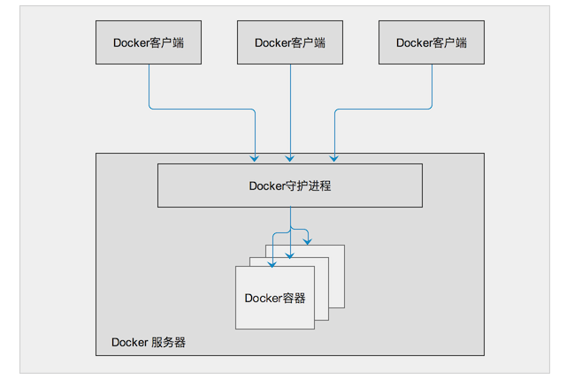

# Docker 之简介

[TOC]

## 1. 虚拟化技术

### 1.1 概述

### 1.2 分类

通过实现方式，虚拟技术可以分为`基于硬件的虚拟化`和`基于软件的虚拟化`。

#### a. 硬件虚拟化

硬件虚拟化就是硬件物理平台本身提供了对特殊指令的截获和重定向的支持。支持虚拟化的硬件，也是一些基于硬件实现软件虚拟化技术的关键。在基于硬件实现软件虚拟化的技术中，在硬件是实现虚拟化的基础，硬件(主要是CPU)会为虚拟化软件提供支持，从而实现硬件资源的虚拟化。

支持虚拟化的硬件：

- **Intel-VT**
- **AMD-V**

#### b. 软件虚拟化

## 2. Docker 

### 2.1 概述

`Docker`是一个开源的应用容器引擎，它让开发者可以打包他们的应用以及依赖包到一个可移植的容器中，然后发布到安装了任何 Linux 发行版本的机器上。`Docker`基于`LXC`来实现类似VM的功能，可以在更有限的硬件资源上提供给用户更多的计算资源。与同VM等虚拟化的方式不同，`LXC`不属于全虚拟化、部分虚拟化或半虚拟化中的任何一个分类，而是一个操作系统级虚拟化。

`Docker`是直接运行在宿主操作系统之上的一个容器，使用沙箱机制完全虚拟出一个完整的操作，容器之间不会有任何接口，从而让容器与宿主机之间、容器与容器之间隔离的更加彻底。每个容器会有自己的权限管理，独立的网络与存储栈，及自己的资源管理能，使同一台宿主机上可以友好的共存多个容器。

`Docker`借助Linux的内核特性，如：控制组（Control Group）、命名空间（Namespace）等，并直接调用操作系统的系统调用接口。从而降低每个容器的系统开销，并实现降低容器复杂度、启动快、资源占用小等特征。

### 2.2 构成

#### a. 架构

`Docker`使用客户端-服务器 (C/S) 架构模式 使用远程API来管理和创建Docker容器。Docker 容器（Container）通过 Docker 镜像（Image）来创建，二者之间的关系类似于面向对象编程中的对象与类。

其中，`Docker`客户端用于向`Docker`服务器或`守护进程`发送请求。而服务器或守护进程会接受来自客户的请求（创建、运行、分发容器），并在处理完请求后返回响应结果。`Docker`提供了一个命令行工具`docker`，及一整套`RESTful API`。客户端和服务端既可以运行在一个机器上，也可通过 `socket`或者`RESTful API`来进行通信。

#### b. 核心组件

Docker 的核心组件包含三部分：`Docker Image`、`Docker Registry`、`Docker Container `。

- **Docker Image -- 镜像**

- **Docker Registry -- 仓库**

`Registry`是 Docker 用于存放镜像的文件仓库，仓库分为`开放()`

- **Docker Container -- 容器**

https://itbilu.com/linux/docker/NycKVWWPG.html

### 2.3 适用范围

