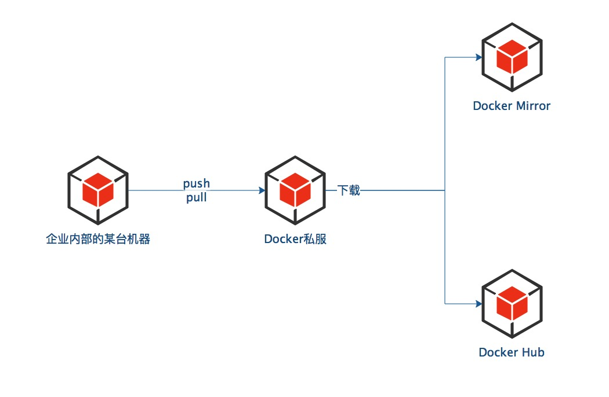

# Docker之镜像管理

[TOC]

## 1. Docker 公有仓库

### 1.1 Docker Hub

`Docker Hub`是 Docker 官方维护的仓库，存放了许多官方发布的镜像。其中`docker search`命令搜索的就是存放在`Docker Hub`中的镜像。

## 2. Docker 私有仓库

`Docker Hub`是一个公有的 Docker 仓库，在实际的使用中，需要将自己私有的镜像保存到私有仓库中，因此私有的 Docker 仓库很有必要。

### 2.1 私有仓库与公有仓库的比较

#### a. 私有仓库的优点

- **节省带宽**
- **更加安全**
- **便于内部统一管理**

### 2.2 Docker registry

`Docker Registry 2.0`来搭建私有仓库。

#### a. 工作原理

#### b. 实现 

- **安装镜像**
- **配置**
- **推送镜像**
- 

## 3. Nexus 管理

## 参考文档

1. [Docker Hub 管理](http://www.itmuch.com/docker/09-docker-docker-hub/)
2. [Docker Registry 管理](http://www.itmuch.com/docker/10-docker-docker-registry/)
3. [Nexus 管理](http://www.itmuch.com/docker/11-docker-nexus/)

https://gitee.com/itmuch/spring-cloud-book/tree/master/3%20使用Docker构建微服务