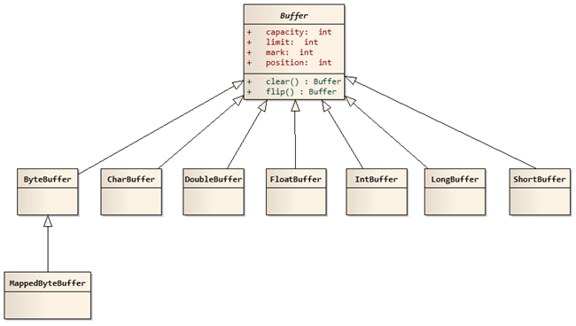

# Java NIO

[TOC]

## 1. 概述

Java NIO 是 JDK 1.4 新推出的一套`non-bocking`接口。

Java 中标准的 IO 是面向字节流或者字符流进行读写操作的，而 NIO 是面向通道与缓冲区进行读写操作。

## 2. NIO 的核心组件

NIO 中的核心组件为：

- **Buffers**
  - ByteBuffer
    - MappedByteBuffer
  - CharBuffer
  - DoubleBuffer
  - FloatBuffer
  - IntBuffer
  - LongBuffer
  - ShortBuffer

- **Channels**

  - FileChannel

    从文件中读写数据。

  - DatagramChannel

    通过UDP读写网络中的数据。

  - SocketChannel

    能通过TCP读写网络中的数据。

  - ServerSocketChannel

    可以监听新进来的TCP连接，像Web服务器那样。对每一个新进来的连接都会创建一个SocketChannel。

- **Selectors**


## 1. Buffer



### 1.1 基础

#### 1.1.2 常用属性

`java.nio.Buffer`中存在的 4 个属性：

```java
// Invariants: mark <= position <= limit <= capacity
private int mark = -1;
private int position = 0;
private int limit;
private int capacity;
```

- **标记(mark)**

>

```java
public final Buffer mark() {
    mark = position;
    return this;
}

// 重置
public final Buffer reset() {
    int m = mark;
    if (m < 0)
        throw new InvalidMarkException();
    position = m;
    return this;
}
```

- **位置(position)**

> 指定了下一个将要被写入或者读取的元素索引，它的值由get()/put()方法自动更新。

```java
// 获取缓冲区的位置
public final int position() {
    return position;
}

// 设置缓冲区的位置
public final Buffer position(int newPosition) {
    if ((newPosition > limit) || (newPosition < 0))
        throw new IllegalArgumentException();
    position = newPosition;
    if (mark > position) mark = -1;
    return this;
}
```

- **限度(limit)**

> 指定还有多少数据需要取出(读数据时)，或者还有多少空间可以放入数据(写数据时)。

```java
// 获取缓冲区的限度
public final int limit() {
    return limit;
}

// 设置缓冲区的限度
public final Buffer limit(int newLimit) {
    if ((newLimit > capacity) || (newLimit < 0))
        throw new IllegalArgumentException();
    limit = newLimit;
    if (position > limit) position = limit;
    if (mark > limit) mark = -1;
    return this;
}
```

- **容量(capacity)**

> 指定了可以存储在缓冲区中的最大数据容量，实际上，它指定了底层数组的大小。

```java
// 获取缓冲区的容量
public final int capacity() {
    return capacity;
}
```

#### 1.1.2 方法

- **flip()**

```java
public final Buffer flip() {
    limit = position;
    position = 0;
    mark = -1;
    return this;
}
```

`flip()`是将当前`buffer`的状态翻转，读状态变成写状态，写状态变成读状态。

- **clear()**

```java
public final Buffer clear() {
    position = 0;
    limit = capacity;
    mark = -1;
    return this;
}
```

`clear()`是将当前的`buffer`的，

- **rewind()**


- **remaining()**


- **hasRemaining()**


### 1.2 提高

#### 1.2.1 ByteBuffer

`ByteBuffer`是一个`abstract`类，实现子类有：`HeapByteBuffer`、`MappedByteBuffer`，其中`MappedByteBuffer`是抽象的，`DirectByteBuffer extends MappedByteBuffer`。

#### 1.2.2 HeapByteBuffer 与 DirectByteBuffer

- **HeapByteBuffer **

在`JVM`堆上创建的`buffer`，其本质为`数组`，用类封装维护属性。

- **DirectByteBuffer**

在`物理内存`上创建的`buffer`，其本质为`操作系统`维护底层的数据，用一个`address`指向数据，从而操作数据。

- **比较**

HeapByteBuffer优点：由于内容维护在jvm里，所以把内容写进buffer里速度会快些；并且，可以更容易回收

DirectByteBuffer优点：跟外设（IO设备）打交道时会快很多，因为外设读取jvm堆里的数据时，不是直接读取的，而是把jvm里的数据读到一个内存块里，再在这个块里读取的，如果使用DirectByteBuffer，则可以省去这一步，实现zero copy（零拷贝） 

题外：外设之所以要把jvm堆里的数据copy出来再操作，不是因为操作系统不能直接操作jvm内存，而是因为jvm在进行gc（垃圾回收）时，会对数据进行移动，一旦出现这种问题，外设就会出现数据错乱的情况

https://www.jianshu.com/p/451cc865d413

## 2. Channel

Channel 与 IO 流的区别：

- NIO 是面向缓冲区的，而 IO 是面向流的。
- 

## 3. selector

selector 允许单个线程处理多个 Channel

https://www.jianshu.com/p/d83d8a2b24e1