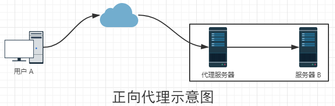
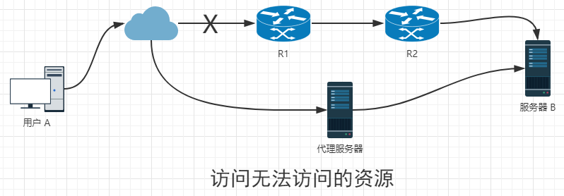
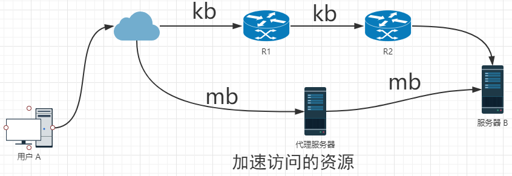

# 各种代理

[TOC]

## 1. 正向代理

> 一般情况下，如果没有特殊说明，所说的代理默认就是正向代理。

正向代理(Forward Proxy)就是一个位于客户端和原始服务器(origin server)之间的服务器，为了从原始服务器取得内容，客户端向代理发送一个请求并指定目标(原始服务器)，然后代理向原始服务器转交请求并将获得的内容返回给客户端。客户端必须设置正向代理服务器，当然前提是要知道正向代理服务器的IP地址，还有代理程序的端口

### 1.1 正向代理作用

#### a. 访问无法访问的资源

当外网的用户无法访问内网的资源时，这时可以通过一台代理服务器，用户提供访问代理服务器，使代理服务器代其访问资源，然后返回资源，从而达到访问无法访问的资源。

#### b. 加速访问服务

加速访问资源这个功能已经没有那么流行了，但是在翻墙下载资料时还是有使用的，原理如上图所示。

#### c. Cache

#### d. 客户端访问授权

#### e. 隐藏访问者

服务器B并不知道访问自己的实际是用户A，因为代理服务器Z代替用户A去直接与服务器B进行交互。如果代理服务器Z被用户A完全控制（或不完全控制），会惯以“肉鸡”术语称呼。

## 2. 反向代理

## 3. 透明代理

https://www.cnblogs.com/Anker/p/6056540.html