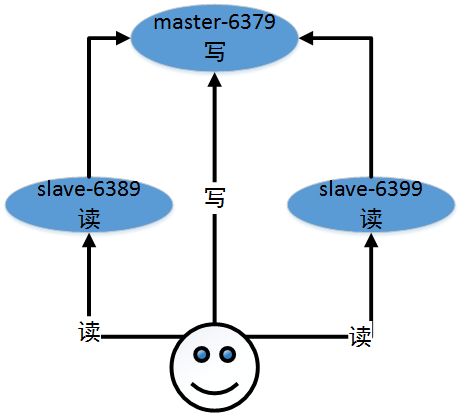

# Redis 高可用之主从复制

[TOC]

## 1. 概述

Redis 虽然具有高可用性，但是由于其是一个单线程模式，在请求量较大时

## 2. 实现

### 2.1 环境

| No.  | IP             | Port | Role   |
| :--: |  :--: |  :--: |  :--: |
|  1   | 192.168.80.128 | 6379 | master |
|  2   | 192.168.80.128 | 6389 | slave  |
|  3   | 192.168.80.128 | 6399 | slave  |



### 2.2 配置文件

Redis 主从模式下，`master`不需要做任何操作，只需要在`slave`中配置如下内容即可：

```shell
> vim redis.conf
slaveof 127.0.0.1 6379
```

### 2.3 验证

#### a. master

```shell
# Replication
role:master
connected_slaves:1
slave0:ip=127.0.0.1,port=6399,state=online,offset=2818,lag=1
master_replid:f650fe0530309e500b05a59086579a3660e79653
master_replid2:0000000000000000000000000000000000000000
master_repl_offset:2818
second_repl_offset:-1
repl_backlog_active:1
repl_backlog_size:1048576
repl_backlog_first_byte_offset:1
repl_backlog_histlen:2818
```

#### b.slave

```shell
# Replication
role:slave
master_host:127.0.0.1
master_port:6389
master_link_status:up
master_last_io_seconds_ago:9
master_sync_in_progress:0
slave_repl_offset:2902
slave_priority:100
slave_read_only:1
connected_slaves:0
master_replid:f650fe0530309e500b05a59086579a3660e79653
master_replid2:0000000000000000000000000000000000000000
master_repl_offset:2902
second_repl_offset:-1
repl_backlog_active:1
repl_backlog_size:1048576
repl_backlog_first_byte_offset:99
repl_backlog_histlen:2804
```

### 2.4 备注

`slave`角色不能进行写操作，如果写入，会报如下错误：

```shell
READONLY You can't write against a read only slave.
```


## 3. 总结

