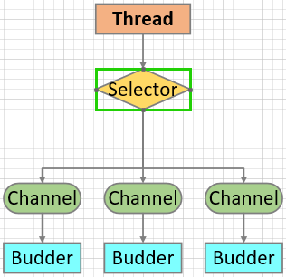

[TOC]

## 2. Selector 实现原理

为了实现`Selector`管理多个`Channel`，必须将具体的`Channel`对象注册到`Selector`，并声明`Selector`需要监听`Channel`的事件。

### 2.1 监听事件

`Selector`监听`Channel`的类型有四类：`read`、`write`、`connect`、`accept`，其值是`java.nio.channels.SelectionKey`中d的常量。

- **read**

`public static final int SelectionKey.OP_READ = 1 << 0;`

当触发`读`事件时，`Selector`会监听到。

- **write**

`public static final int SelectionKey.OP_WRITE = 1 << 2;`

当触发`写`事件时，`Selector`会监听到。

- **connect**

`public static final int SelectionKey.OP_CONNECT = 1 << 3;`

当触发`客户端连接服务端`事件时，`Selector`会监听到。

- **accept**

`public static final int SelectionKey.OP_ACCEPT = 1 << 4;`

当触发`服务端接收客户端连接`事件时，`Selector`会监听到。

