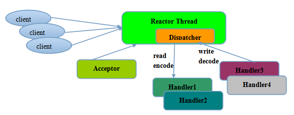
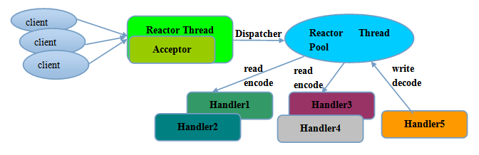
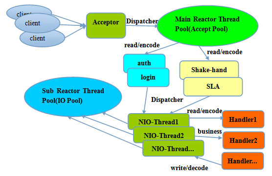

# Netty 简介

[TOC]

## 1. Netty 概述

Netty 是一个高性能、异步事件启动的 NIO 框架，提供了对`TCP`、`UDP`、`文件传输`的支持，通过`Future-Listener`机制，用户可以方便的诸佛那个获取或者通过通知机制获取 I/O 操作的结果。

### 1.1 Reactor 模型

`Netty`中的`Reactor`模型是由`多路复用器(Acceptor)`、`事件分发器(Dispatcher)`、`事件处理器(Handler)`组成。

#### a. 单线程模型

所有的 I/O 操作都要有一个线程完成，即多路复用、事件触发和事件处理都在一个 Reactor 线程上完成。

- **特点**

- **应用场景**

对于小容量应用，可以选择单线程模型，但是高负载、大并发的应用却不合适。

#### b. 多线程模型

为了解决单线程模型存在问题，从而演变来了多线程模型。

- **特点**

- **应用场景**

#### c. 主从多线程模型

采用多个 Reactor，每个 Reactor 都在自己单独的线程中运行。如果是多核 CPU，则可以同时响应多个客户端请求，一点链路创建成功就将链路注册到负责 i/0 读写的 SubReactor 线程池中。

- **特点**

- **应用场景**

