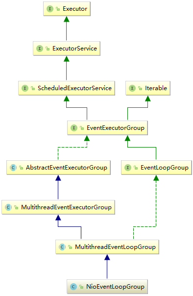

# Netty 之服务启动分析

[TOC]

Netty 是基于 NIO 实现的，所以离不开`Selector`、`Channel`、`Buffer`三元素，只不过`Netty`将三元素进行了底层的封装。


## 1. ServerBootstrap

服务端是一个`ServerBootstrap`实体，通过`serverBootstrap.bind(p)`启动服务，

## 1. NioEventLoopGroup




`NioEventLoopGroup`的父类为`MultithreadEventLoopGroup`，管理`EventLoop`的生命周期。

`EventLoop`是内部的一个处理线程，数量默认是处理器个数的二倍。

```java
private static final int DEFAULT_EVENT_LOOP_THREADS = Math.max(1, SystemPropertyUtil.getInt("io.netty.eventLoopThreads", NettyRuntime.availableProcessors() * 2));
```


## 2. NioEventLoop

